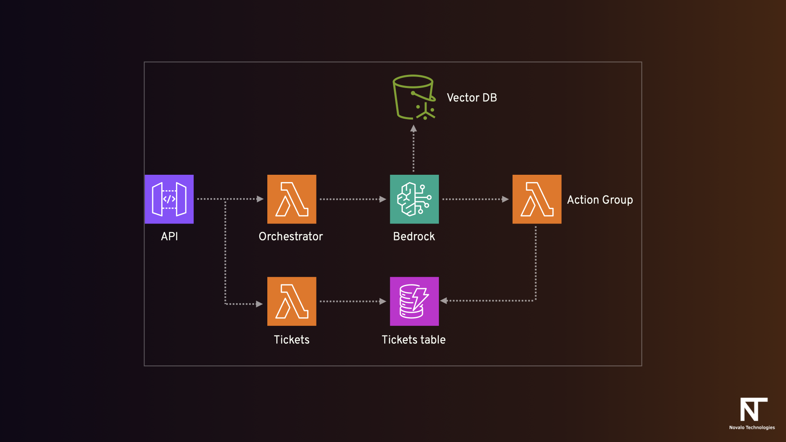

# ITHoS Bedrock Agent Demo (CloudFormation)

<p align="center">
  
</p>

## Overview

Workshop-friendly serverless demo with:

- API Gateway WebSocket API (`$connect`, `$disconnect`, `sendMessage`) for two-way chat
- Orchestrator Lambda (Python 3.12) invoking Bedrock Agent Runtime (`invoke_agent`)
- Action Group Lambda (Python 3.12) creating support tickets in DynamoDB
- HTTP API `GET /tickets` backed by Ticket Reader Lambda (Python 3.12)
- DynamoDB table for support tickets
- Browser test console in `frontend/index.html`

Intended region: `eu-central-1`.

## Architecture and Flow

1. Client connects to WebSocket API.
2. Client sends `{ "action": "sendMessage", "message": "..." }`.
3. API Gateway routes to Orchestrator Lambda.
4. Orchestrator runs rule-based intent detection.
5. Supported intents call Bedrock Agent Runtime.
6. Fallback intents return direct responses (no Bedrock call).
7. Response is sent back with `post_to_connection`.

Response payload includes:

- `sessionId`
- `intent`
- `confidence`
- `answer`

## Repository Structure

```text
template.yaml
src/
  orchestrator/
    app.py
  action_group/
    app.py
    support-ticket-api-schema.json
  ticket_reader/
    app.py
frontend/
  index.html
agent-instructions/
  instructions.md
knowledge-base/
  *.md
  *.metadata.json
.github/
  workflows/
    deploy.yml
README.md
Bedrock-EventGraph.001.png
```

## Infrastructure Model

This repository uses plain CloudFormation (StackSet-compatible), not SAM transform resources.

Template resources include:

- `AWS::Lambda::Function`
- `AWS::ApiGatewayV2::*`
- `AWS::IAM::Role`
- `AWS::DynamoDB::Table`

Lambda code is supplied by parameters:

- `LambdaCodeS3Bucket`
- `OrchestratorCodeS3Key`
- `ActionGroupCodeS3Key`
- `TicketReaderCodeS3Key`

## CI/CD (GitHub Actions + OIDC)

Workflow:

- `.github/workflows/deploy.yml`

Triggers:

- push to `main`
- manual `workflow_dispatch`

Required GitHub settings:

- Secret: `AWS_DEPLOY_ROLE_ARN`
- Secret: `ORG_PATH`
- Variable: `SAM_DEPLOY_S3_BUCKET`
- Variable: `FRONTEND_S3_BUCKET`

Pipeline behavior:

- assumes AWS role with OIDC
- validates `template.yaml`
- zips Lambda code from `src/*`
- uploads Lambda artifacts to `s3://<SAM_DEPLOY_S3_BUCKET>/lambda/...` with deploy-specific keys (`SHA + run id`)
- uploads canonical template to `s3://<SAM_DEPLOY_S3_BUCKET>/cloudformation/current-template.yaml`
- deploys stack using `aws cloudformation deploy`
- syncs `frontend/` to `FRONTEND_S3_BUCKET`
- ensures artifact bucket policy includes org-path scoped read via `aws:PrincipalOrgPaths`

## Required Runtime Configuration (ClickOps during event)
- `BEDROCK_AGENT_ID`
- `BEDROCK_AGENT_ALIAS_ID`

## Intent Detection Examples

- `What is API Design?` -> `ASK_COURSE_INFO`
- `Which courses are in Autumn 2026?` -> `LIST_OR_FILTER_COURSES`
- `Compare DevOps and API Design` -> `COMPARE_COURSES`
- `I can't access AWS. Can you create a support ticket?` -> `CREATE_SUPPORT_TICKET`
- `Create a ticket` -> `MISSING_CONTEXT`
- `Register me for API Design` -> `UNSUPPORTED_ACTION`
- `What is the weather?` -> `OUT_OF_SCOPE`
- `Help` -> `UNCLEAR`

## Ticket API

Endpoint:

- `GET /tickets`

Examples:

- `GET /tickets`
- `GET /tickets?status=Open`
- `GET /tickets?ticketId=<ticket-id>`

Behavior:

- `ticketId` set: return single ticket
- `status` set: return filtered tickets (`Open` or `Closed`)
- no filter: return all tickets

## Frontend Test Console

File:

- `frontend/index.html`

Features:

- ticket count + ticket details from Ticket Reader API
- connect-first WebSocket chat
- timestamped user/assistant messages

Usage:

1. Serve locally over HTTP  `cd frontend && python3 -m http.server 8080`
2. Open `http://localhost:8080`.
3. Enter `TicketsHttpApiEndpoint`, click **Load Tickets**.
4. Enter `WebSocketApiEndpoint`, click **Start Chat**.

Example chat payload:

```json
{
  "action": "sendMessage",
  "message": "I can't access AWS. Can you create a support ticket?",
  "sessionId": "demo-session-1"
}
```

(`sessionId` is optional; Orchestrator generates one if omitted.)

## Bedrock Action Group Contract

OpenAPI action-group schema:

- `src/action_group/support-ticket-api-schema.json`

Contract style:

- input uses `apiPath`, `httpMethod`, `parameters`, `requestBody`
- response uses `messageVersion: "1.0"` and `response.responseBody.application/json.body`

Created ticket shape:

```json
{
  "ticketId": "uuid",
  "description": "problem description",
  "createdAt": "ISO timestamp",
  "status": "Open"
}
```

Allowed status values:

- `Open`
- `Closed`

## CloudFormation Outputs

- `WebSocketApiEndpoint`
- `TicketsHttpApiEndpoint`
- `OrchestratorLambdaName`
- `ActionGroupLambdaName`
- `TicketReaderLambdaName`
- `SupportTicketsTableName`

## Notes

- all Lambdas use Python `3.12`
- implementation uses `boto3`
- Bedrock Agent ID/Alias will be configured manually during the session
